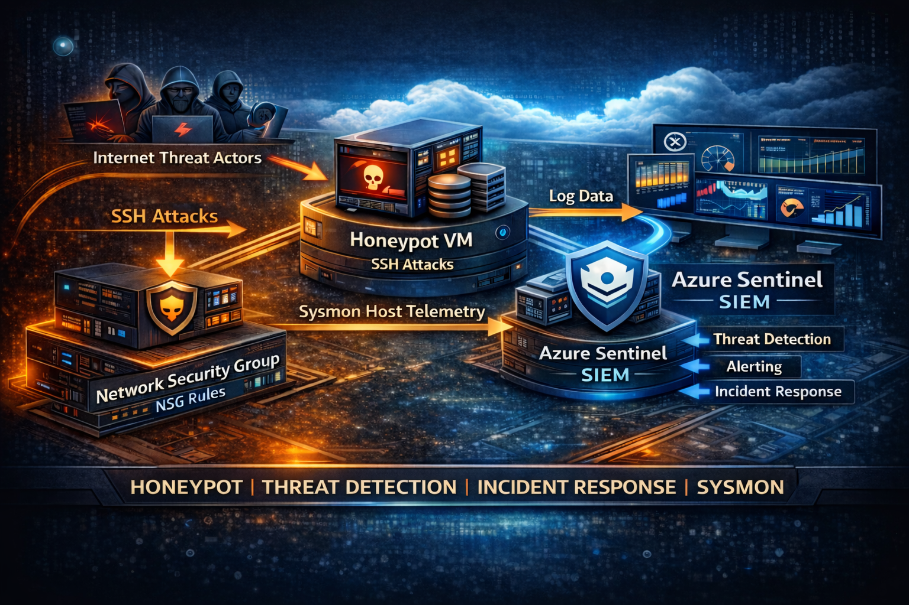
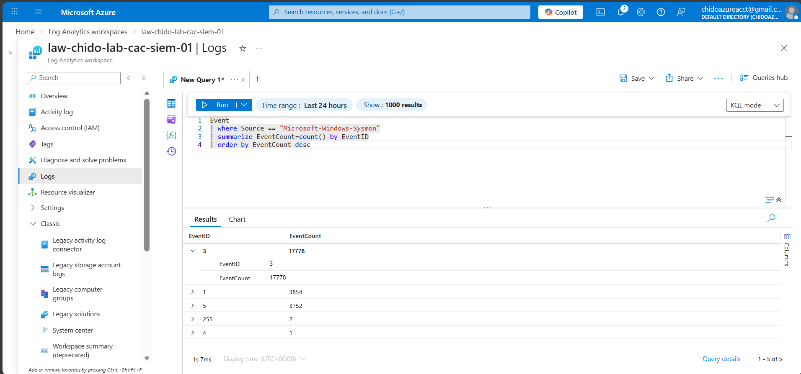
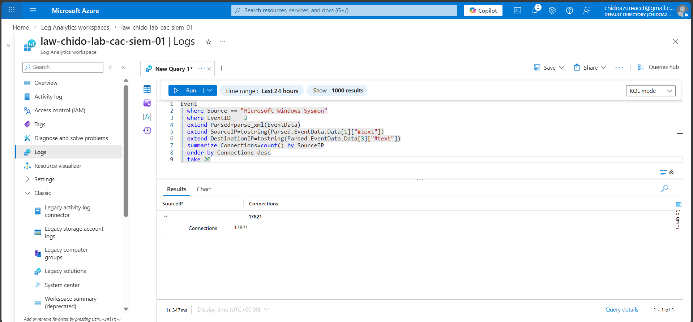
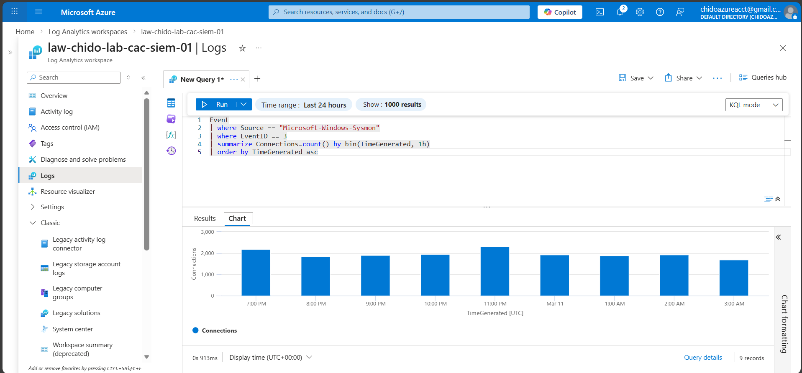
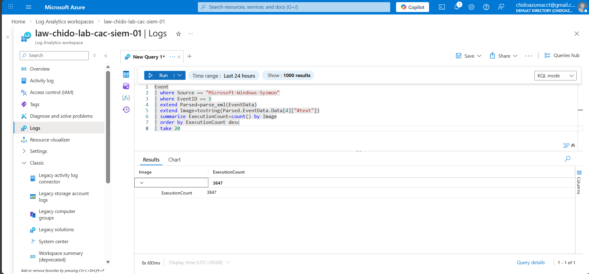
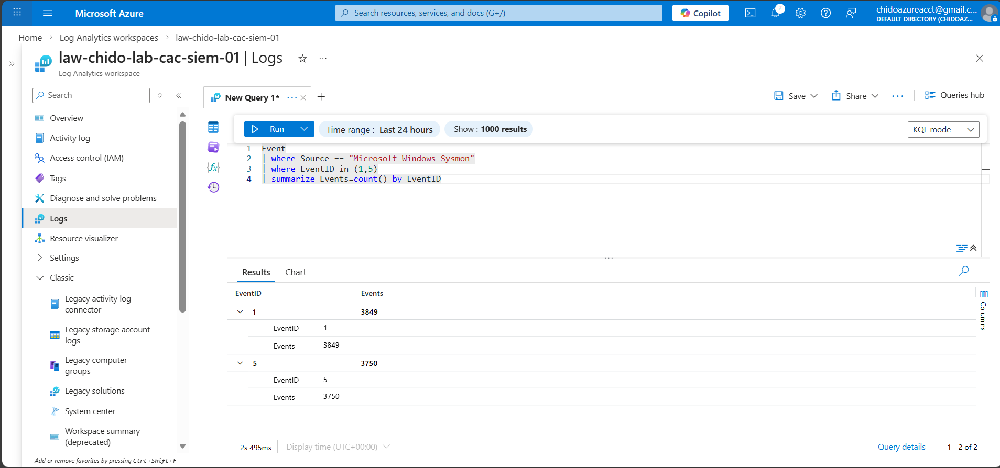

# Azure Detection Engineering Lab  
### Cloud Endpoint Telemetry | Threat Hunting | Microsoft Sentinel



## Overview

This project demonstrates how to design a **cloud-based detection engineering pipeline** capable of generating, ingesting, and analyzing endpoint telemetry from a Windows workload running in Microsoft Azure.

Rather than focusing on simple log collection, this lab emphasizes **security visibility, telemetry engineering, and threat hunting workflows** similar to those used by modern Security Operations Centers (SOC).

A cloud-hosted VM was intentionally exposed to the internet to observe how external infrastructure interacts with publicly reachable systems. Endpoint telemetry was then normalized and analyzed using **Sysmon, Azure Monitor, Log Analytics, and Microsoft Sentinel**.

The result is a working detection engineering environment capable of identifying behavioral patterns across:

- network activity  
- process execution  
- endpoint lifecycle events  

---

# Architecture

Telemetry pipeline implemented in this lab:

Internet Traffic  
↓  
Azure Windows VM  
↓  
Sysmon Endpoint Telemetry  
↓  
Azure Monitor Agent  
↓  
Data Collection Rule  
↓  
Log Analytics Workspace  
↓  
KQL Threat Hunting Queries  
↓  
Microsoft Sentinel

### Core Components

| Component | Role |
|---|---|
| Azure VM | Cloud workload generating telemetry |
| Sysmon | High-fidelity endpoint logging |
| Azure Monitor Agent | Secure telemetry forwarding |
| Data Collection Rules | Structured ingestion configuration |
| Log Analytics | Centralized log storage |
| Microsoft Sentinel | Threat hunting and detection platform |

This architecture reflects the **typical telemetry pipeline used by cloud-native security operations teams**.

---

# Telemetry Engineering

## Sysmon Configuration

Sysmon was deployed to generate high-fidelity endpoint telemetry.

Enabled event types:

| Event ID | Description |
|---|---|
| 1 | Process creation |
| 3 | Network connections |
| 5 | Process termination |
| 255 | Sysmon operational events |

These signals provide visibility into:

- command-line execution  
- process lineage  
- endpoint network activity  
- runtime process lifecycle behavior  

---

# Telemetry Validation

Initial validation confirmed successful ingestion of Sysmon telemetry into Log Analytics.

### Query

```kql
Event
| where Source == "Microsoft-Windows-Sysmon"
| summarize EventCount=count() by EventID
| order by EventCount desc
```

### Observed Telemetry Volume
| EventID | Description         | Events |
| ------- | ------------------- | ------ |
| 3       | Network connections | 17,778 |
| 1       | Process creation    | 3,854  |
| 5       | Process termination | 3,752  |




# Network Exposure Analysis

The VM was intentionally reachable from the internet to observe baseline attack surface interaction.

### Query
```kql
Event
| where Source == "Microsoft-Windows-Sysmon"
| where EventID == 3
| extend Parsed=parse_xml(EventData)
| extend SourceIP=tostring(Parsed.EventData.Data[1]["#text"])
| extend DestinationIP=tostring(Parsed.EventData.Data[3]["#text"])
| summarize Connections=count() by SourceIP
| order by Connections desc
| take 20
```
### Result

Total network connections observed:

17,821

Even minimally exposed infrastructure receives continuous background traffic from automated internet scanning infrastructure.




# Network Activity Timeline

Analyzing activity over time helps identify abnormal spikes or attack windows.

### Query
```kql
Event
| where Source == "Microsoft-Windows-Sysmon"
| where EventID == 3
| summarize Connections=count() by bin(TimeGenerated, 1h)
| order by TimeGenerated asc
```
### Results





# Endpoint Process Behavior

Process telemetry provides insight into how workloads behave internally.

### Query
```kql
Event
| where Source == "Microsoft-Windows-Sysmon"
| where EventID == 1
| extend Parsed=parse_xml(EventData)
| extend Image=tostring(Parsed.EventData.Data[4]["#text"])
| summarize ExecutionCount=count() by Image
| order by ExecutionCount desc
| take 20
```
### Result

3,847 process executions observed



# Process Lifecycle Monitoring

Process start and termination telemetry allows visibility into system runtime behavior.

### Query
```kql
Event
| where Source == "Microsoft-Windows-Sysmon"
| where EventID in (1,5)
| summarize Events=count() by EventID
```
### Observed Activity
| EventID | Activity            | Count |
| ------- | ------------------- | ------ |
| 1       | Process Start       | 3,849 |
| 5       | Process termination | 3,750|




# Detection Engineering Approach

The objective of this lab was to build telemetry capable of supporting detection engineering workflows.

The methodology used follows a common detection engineering process:

- Generate high fidelity endpoint telemetry

- Normalize raw event structures

- Identify meaningful security signals

- Build threat hunting queries

- Convert successful hunts into detection logic

This mirrors how modern SOC teams develop detection capabilities.

# Technologies Used

- Microsoft Azure

- Microsoft Sentinel

- Azure Monitor

- Log Analytics

- Sysmon

- Kusto Query Language (KQL)


# Skills Demonstrated

- Cloud security architecture

- Endpoint telemetry engineering

- Threat hunting

- KQL query development

- Security monitoring in Microsoft Sentinel

# Future Enhancements

- Microsoft Defender for Cloud integration

- Sentinel analytic rules

- Automated detection playbooks

- Threat intelligence enrichment
